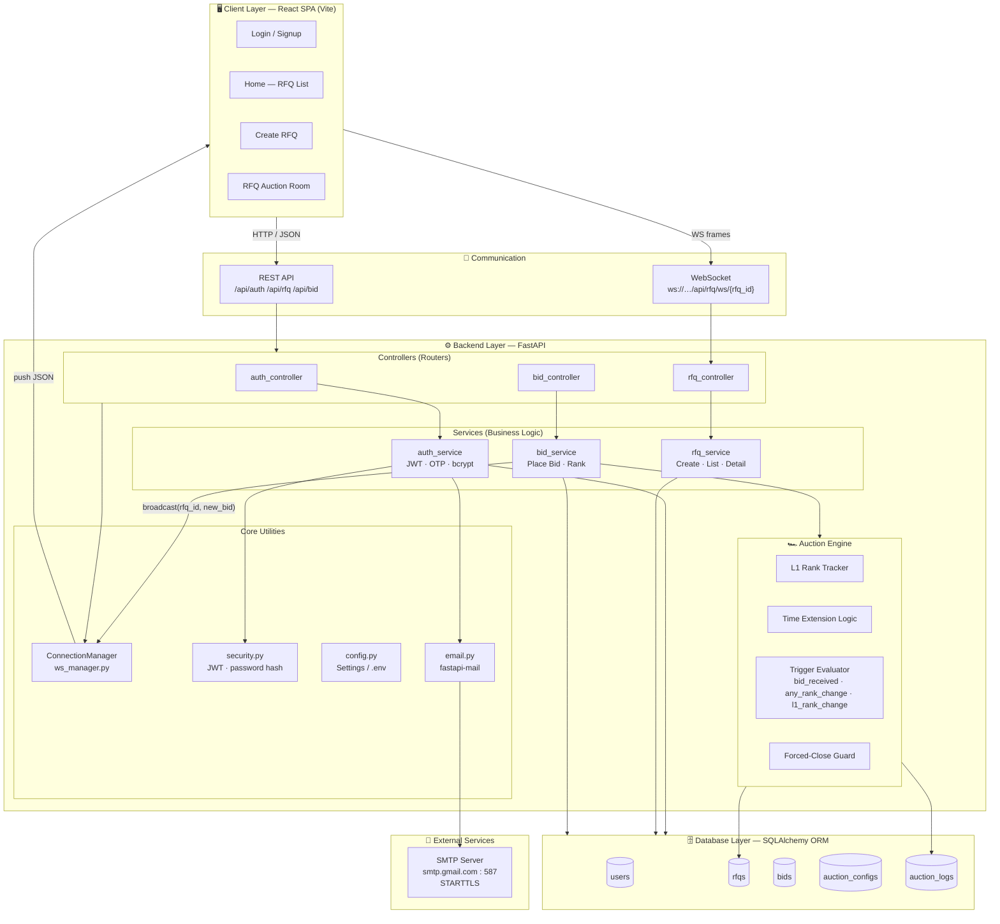

# 📐 High-Level Design — Bid-Out (British Auction Platform)

> **Version:** 1.0 &nbsp;|&nbsp; **Date:** April 2026 &nbsp;|&nbsp; **Stack:** React + FastAPI + SQLite/PostgreSQL

---

## 🏗️ Architecture Diagram



---

## 🧾 System Explanation

The system follows a **layered architecture** with clear separation of concerns across three tiers.

### 🖥️ Client Layer — React SPA
Built with **React + Vite**, the frontend is a single-page application organised into pages and service modules:

| Page | Role |
|---|---|
| `Login / Signup` | OTP-based email authentication |
| `Home` | Lists all active RFQs with lowest bid & forced-close time |
| `Create RFQ` | Buyers define shipment details and auction configuration |
| `RFQ Auction Room` | Real-time bid leaderboard with live WebSocket updates |

Frontend service modules (`authApi.js`, `rfqApi.js`, `bidApi.js`) act as a clean boundary — all HTTP calls go through an **Axios instance** configured with the base URL.

---

### ⚙️ Backend Layer — FastAPI
The backend follows a **Controller → Service → Engine / Core → DB** pipeline:

| Layer | Files | Responsibility |
|---|---|---|
| **Controllers** | `auth_controller`, `rfq_controller`, `bid_controller` | Route definitions, request validation, auth guards |
| **Services** | `auth_service`, `rfq_service`, `bid_service` | Pure business logic, DB interactions |
| **Auction Engine** | Inside `bid_service.py` | Bid ranking, time extension, trigger evaluation |
| **Core Utilities** | `ws_manager`, `security`, `email`, `config` | Cross-cutting concerns |

#### Auth Service
- Password hashing via **bcrypt**
- Token generation/validation via **JWT (HS256)** — 30-minute expiry
- OTP flow: generate → send via SMTP → verify before issuing token

#### RFQ Service
- Buyers create RFQs with `bid_start_at`, `bid_close_at`, `forced_close_at`
- Lists all RFQs (public endpoint, no auth required)
- Detail endpoint returns ranked bids + auction config + logs

#### Bid Service
- Only `seller` role users can submit bids (403 for buyers)
- Validates submission is within the active `[bid_start_at, bid_close_at]` window
- Computes `total_charges = freight_charges + origin_charges + destination_charges`
- After saving, broadcasts `{ "type": "new_bid" }` to all WebSocket clients in the room

#### 🏎️ Auction Engine
Embedded in `bid_service.py`, responsible for automatic time extension:

```
Check if bid falls within trigger window
    └─ Evaluate trigger type
        ├─ bid_received     → any bid in last N min
        ├─ any_rank_change  → any supplier rank shifted
        └─ l1_rank_change   → L1 (lowest) position changed
    └─ Extend bid_close_at += extension_duration_minutes
        (capped at forced_close_at — never exceeds it)
    └─ Write AuctionLog entry
```

| Trigger Type | Condition |
|---|---|
| `bid_received` | Any bid placed in the trigger window |
| `any_rank_change` | Any supplier's rank shifted |
| `l1_rank_change` | The L1 (lowest cost) position changed hands |

---

### 🗄️ Database Layer — SQLAlchemy ORM

| Table | Key Columns | Purpose |
|---|---|---|
| `users` | `id, email, role, password_hash` | Buyer / Seller accounts |
| `rfqs` | `id, bid_start_at, bid_close_at, forced_close_at, status` | Shipment requests |
| `bids` | `rfq_id, supplier_id, freight_charges, origin_charges, destination_charges` | Individual bids |
| `auction_configs` | `rfq_id, trigger_type, trigger_window_minutes, extension_duration_minutes` | Auction extension rules |
| `auction_logs` | `rfq_id, event_type, message` | Immutable audit trail |

---

### 📧 External Services — SMTP (Gmail)
Used for **OTP verification** during login/signup via `fastapi-mail`.

- Server: `smtp.gmail.com:587` with STARTTLS
- Triggered only during the authentication flow
- HTML-formatted email template defined in `core/email.py`

---

### 🔁 Communication — REST + WebSocket

| Protocol | Endpoint Pattern | Used For |
|---|---|---|
| **REST / HTTP** | `/api/auth/*` | Register, login, OTP verify |
| **REST / HTTP** | `/api/rfq/*` | Create, list, get detail, ranked bids |
| **REST / HTTP** | `/api/bid/*` | Place bid |
| **WebSocket** | `ws://.../api/rfq/ws/{rfq_id}` | Real-time bid notifications per auction room |

The WebSocket connection is **room-scoped** — `ConnectionManager` maintains `dict[rfq_id → list[WebSocket]]`, so only clients viewing a specific RFQ receive its updates.

---

## 🔁 High-Level Request Flow

```
1.  User opens browser  →  React SPA loads
2.  User logs in        →  POST /api/auth/login  →  JWT returned  →  stored in memory
3.  Home page           →  GET /api/rfq/list     →  renders RFQ cards (lowest bid, forced-close)
4.  Enter Auction Room  →  Socket.IO connects  →  join room `rfq:{rfq_id}`
5.  Seller submits bid  →  POST /api/bid/place
    └─ bid_service validates window, saves bid, evaluates extension
    └─ emit("detail_update") to all Socket.IO clients in room
6.  All clients receive push  →  UI refreshes leaderboard
7.  All data (bids, logs, time changes) persisted in the database
```

---

## 📦 Tech Stack Summary

| Component | Technology |
|---|---|
| Frontend | React 18, Vite, Axios |
| Backend | FastAPI (Python 3.12) |
| ORM | SQLAlchemy 2.x |
| Database | SQLite (dev) / PostgreSQL (prod-ready) |
| Auth | JWT (HS256) + bcrypt + OTP via email |
| Real-time | Socket.IO rooms |
| Email | fastapi-mail + Gmail SMTP (STARTTLS) |
| Config | pydantic-settings + `.env` |

---

*This document reflects the actual implementation in the `Bid-out-Gocomet` codebase as of April 2026.*
