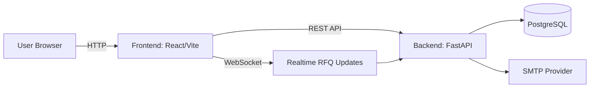
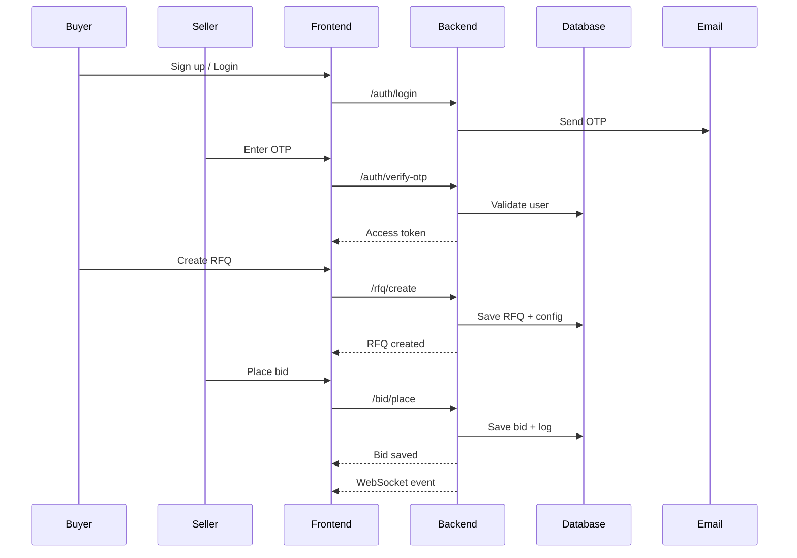

# Bid Out - Logistics Auction Platform

A full-stack RFQ and bidding platform for logistics auctions. Buyers publish RFQs, sellers place bids in real time, and auctions extend automatically based on configurable rules.

## Project Box

| Layer | Stack Used |
|---|---|
| Frontend | React (Vite), Tailwind CSS |
| Backend | FastAPI, SQLAlchemy |
| Database | PostgreSQL |
| Realtime | WebSocket |
| Authentication | JWT + OTP (Email SMTP) |
| API Style | REST |

## Highlights
- Buyer and seller roles with OTP-based login
- RFQ creation with British auction extensions
- Live bid updates with WebSocket events
- Auction ranking, activity logs, and winner view

## Tech Stack
- Backend: FastAPI, SQLAlchemy, PostgreSQL
- Frontend: React (Vite), Tailwind CSS

## Project Structure
```
Bid-out-Gocomet/                     → Root project containing backend, frontend, and docs
│
├── Backend/                         → FastAPI backend handling APIs, business logic, and DB
│   ├── app/                         → Core application code
│   │   ├── controllers/             → API route handlers (request/response layer)
│   │   ├── services/                → Business logic (auction rules, bidding, RFQ handling)
│   │   ├── models/                  → Database models (tables and relationships)
│   │   ├── schemas/                 → Request/response validation using Pydantic
│   │   ├── core/                    → Shared utilities (auth, config, WebSocket manager)
│   │   └── main.py                  → Entry point of FastAPI application
│   ├── requirements.txt             → Backend dependencies
│   └── .env.example                 → Example environment variables configuration
│
├── Frontend/                        → React (Vite) frontend for UI and user interaction
│   ├── src/                         → Main frontend source code
│   │   ├── components/              → Reusable UI components (cards, navbar, etc.)
│   │   ├── pages/                   → Application pages (Home, Auction, RFQ creation)
│   │   ├── services/                → API integration layer (backend communication)
│   │   └── App.jsx                  → Root React component
│   ├── package.json                 → Frontend dependencies and scripts
│   └── vite.config.js               → Build and dev server configuration
│
├── README.md                        → Project overview and setup instructions
└── HLD.md                           → High-Level Design and architecture documentation
```

## Architecture (HLD)


## Workflow Diagram


## Setup

### Backend
1. Create environment file from example:
   - Copy `Backend/.env.example` to `Backend/.env`
2. Install dependencies:
   - `pip install -r Backend/requirements.txt`
3. Run the API:
   - `uvicorn app.main:app --reload --app-dir Backend`

### Frontend
1. Install dependencies:
   - `cd Frontend`
   - `npm install`
2. Start the dev server:
   - `npm run dev`

## Environment Variables
Backend uses `Backend/.env` (see `Backend/.env.example`).

Key values:
- `DATABASE_URL` - Postgres connection string
- `SECRET_KEY` - JWT signing key
- `MAIL_*` - SMTP config for OTP

Frontend API base is currently set in `Frontend/src/services/api.js`.

## API Overview
- `POST /api/auth/signup`
- `POST /api/auth/login`
- `POST /api/auth/verify-otp`
- `GET /api/auth/me`
- `POST /api/rfq/create`
- `GET /api/rfq/list`
- `GET /api/rfq/{id}`
- `GET /api/rfq/{id}/detail`
- `POST /api/bid/place`
- `GET /api/bid/list/{rfq_id}`
- `GET /api/bid/my-rfqs`

## Notes
- WebSocket endpoint: `/api/rfq/ws/{rfq_id}`
- OTP is sent via configured SMTP settings

## License
MIT


