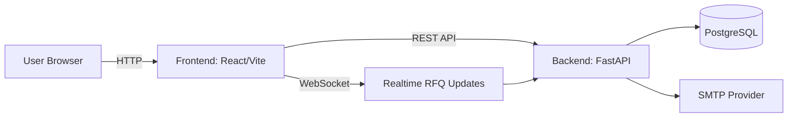
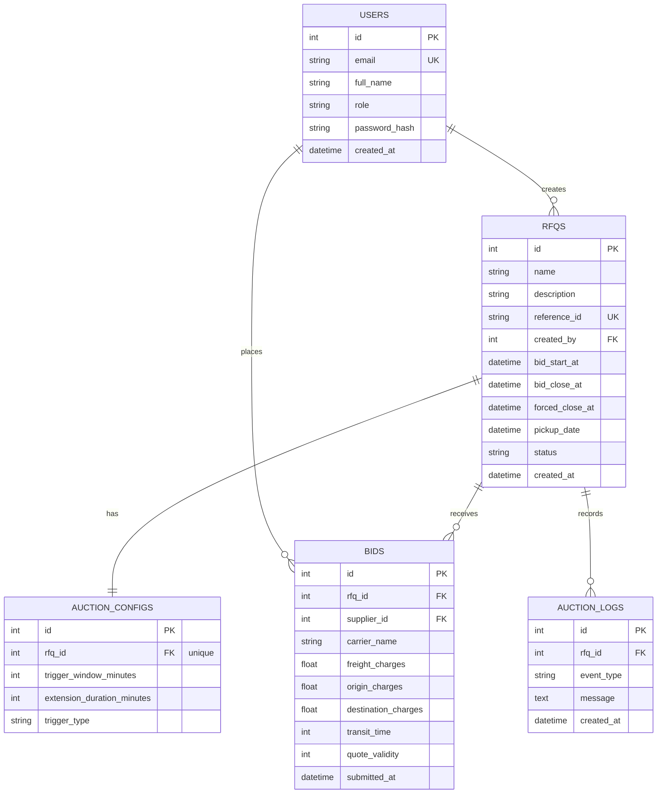
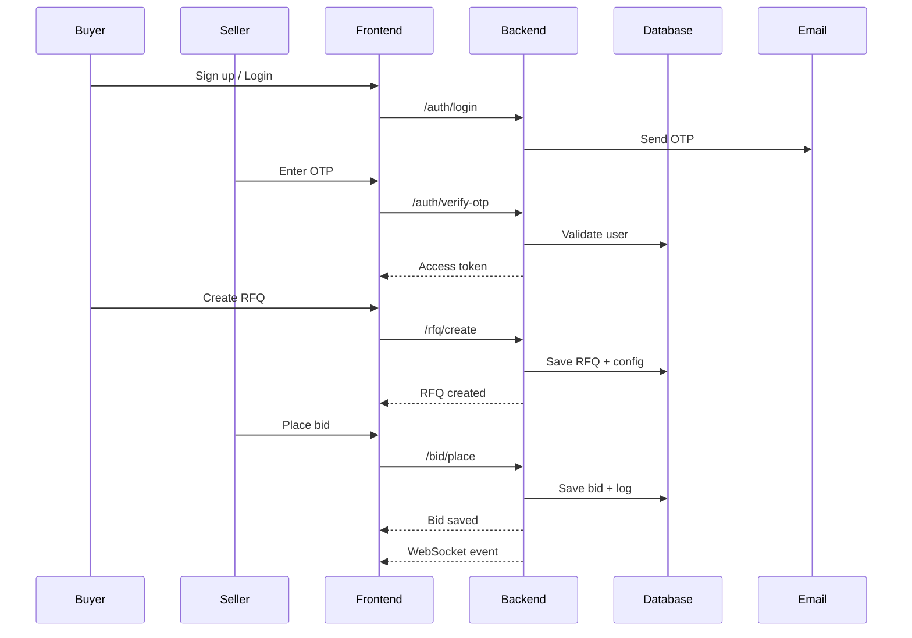

# Bid Out - Logistics Auction Platform

A full-stack RFQ and bidding platform for logistics auctions. Buyers publish RFQs, sellers place bids in real time, and auctions extend automatically based on configurable rules.

## Project Box

| Layer | Stack Used |
|---|---|
| Frontend | React (Vite), Tailwind CSS |
| Backend | FastAPI, SQLAlchemy |
| Database | PostgreSQL |
| Realtime | WebSocket |
| Authentication | JWT + OTP (Email SMTP) |
| API Style | REST |

## Highlights
- Buyer and seller roles with OTP-based login
- RFQ creation with British auction extensions
- Live bid updates with WebSocket events
- Auction ranking, activity logs, and winner view

## Tech Stack
- Backend: FastAPI, SQLAlchemy, PostgreSQL
- Frontend: React (Vite), Tailwind CSS

## Project Structure
```
Bid-out-Gocomet/
|-- Backend/
|   |-- .env.example
|   |-- fix_db.py
|   |-- requirements.txt
|   `-- app/
|       |-- main.py
|       |-- controllers/
|       |   |-- auth_controller.py
|       |   |-- bid_controller.py
|       |   `-- rfq_controller.py
|       |-- core/
|       |   |-- config.py
|       |   |-- email.py
|       |   |-- security.py
|       |   `-- ws_manager.py
|       |-- database/
|       |   |-- base.py
|       |   `-- session.py
|       |-- models/
|       |   |-- __init__.py
|       |   |-- rfq.py
|       |   `-- user.py
|       |-- schemas/
|       |   |-- auth.py
|       |   |-- bid.py
|       |   `-- rfq.py
|       `-- services/
|           |-- auth_service.py
|           |-- bid_service.py
|           `-- rfq_service.py
|-- Frontend/
|   |-- .gitignore
|   |-- eslint.config.js
|   |-- index.html
|   |-- package-lock.json
|   |-- package.json
|   |-- vite.config.js
|   |-- public/
|   `-- src/
|       |-- App.jsx
|       |-- index.css
|       |-- main.jsx
|       |-- assets/
|       |-- components/
|       |   |-- AuctionCard.jsx
|       |   |-- AuthModal.jsx
|       |   |-- Navbar.jsx
|       |   `-- Toast.jsx
|       |-- hooks/
|       |   `-- useAuth.js
|       |-- pages/
|       |   |-- CreateRFQ.jsx
|       |   |-- Home.jsx
|       |   |-- Login.jsx
|       |   |-- RFQAuction.jsx
|       |   `-- Signup.jsx
|       |-- services/
|       |   |-- api.js
|       |   |-- authApi.js
|       |   |-- bidApi.js
|       |   `-- rfqApi.js
|       `-- utils/
|-- .gitignore
|-- HLD.md
`-- README.md
```

## Architecture (HLD)


## Interactive Database Schema


## Workflow Diagram


## Setup

### Backend
1. Create environment file from example:
   - Copy `Backend/.env.example` to `Backend/.env`
2. Install dependencies:
   - `pip install -r Backend/requirements.txt`
3. Run the API:
   - `uvicorn app.main:app --reload --app-dir Backend`

### Frontend
1. Install dependencies:
   - `cd Frontend`
   - `npm install`
2. Start the dev server:
   - `npm run dev`

## Environment Variables
Backend uses `Backend/.env` (see `Backend/.env.example`).

Key values:
- `DATABASE_URL` - Postgres connection string
- `SECRET_KEY` - JWT signing key
- `MAIL_*` - SMTP config for OTP

Frontend API base is currently set in `Frontend/src/services/api.js`.

## API Overview
- `POST /api/auth/signup`
- `POST /api/auth/login`
- `POST /api/auth/verify-otp`
- `GET /api/auth/me`
- `POST /api/rfq/create`
- `GET /api/rfq/list`
- `GET /api/rfq/{id}`
- `GET /api/rfq/{id}/detail`
- `POST /api/bid/place`
- `GET /api/bid/list/{rfq_id}`
- `GET /api/bid/my-rfqs`

## Notes
- Real-time updates use Socket.IO rooms (default `/socket.io` endpoint)
- OTP is sent via configured SMTP settings

## License
MIT


